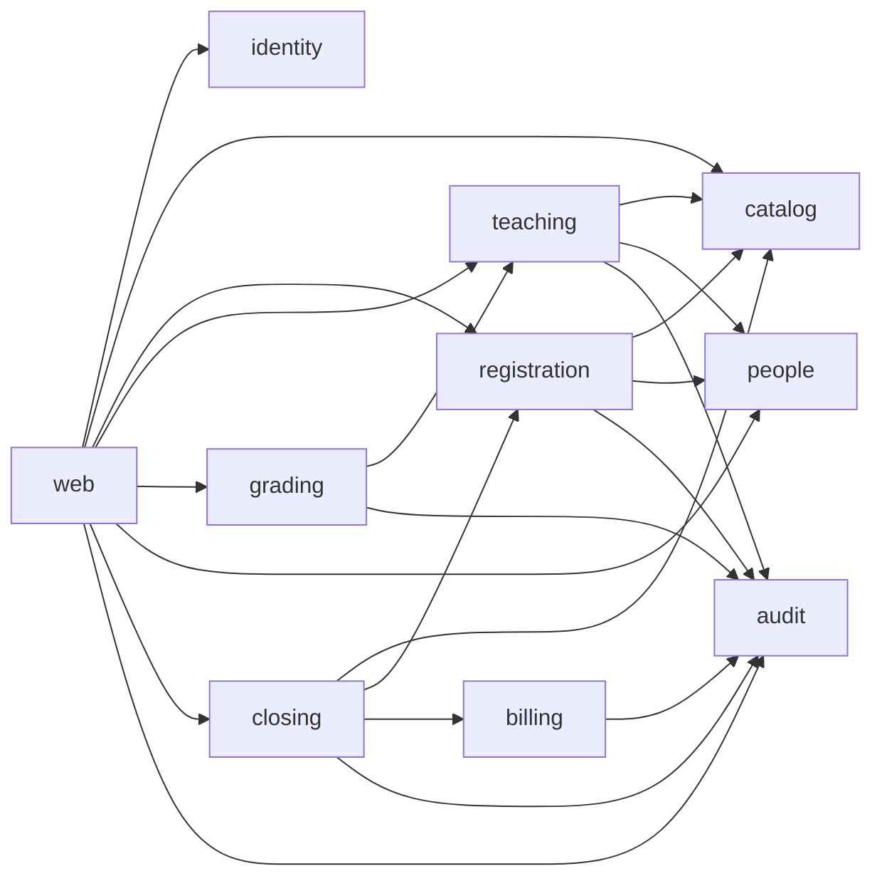

# Service 模块分布与编码说明

> 依据《03-设计文档》《02-需求分析文档》和当前 `backend` 实体映射整理。
> 本文是编码蓝图：类名、方法和 DTO 可以在实现时微调，但业务规则、锁顺序、事务边界必须保持一致。

## 1. 适用范围

当前后端包名为 `com.gm222.courseregistrationsystem`，持久化采用 Spring Data JPA/Hibernate，数据库表由 `课程设计文档/04-MySQL9.6初始化.sql` 创建。原设计提到 MyBatis；Service 层不依赖具体查询技术，锁查询可用 JPA `@Query(nativeQuery = true)` 或自定义 Repository 实现完成。

已有实体位于 `model/entity`，共 19 个。本文不再创建重复的 Entity，也不建议给每个表生成一个绕过规则的通用 CRUD Service。

### 1.1 目录目标

```text
backend/src/main/java/com/gm222/courseregistrationsystem/
├── config/                         # JPA、Security、Jackson、时钟等配置
├── model/entity/                   # 已有实体，不直接作为 API 入参/出参
├── model/dto/                      # 请求、响应和内部结果对象
├── repository/                    # 聚合查询、锁查询和持久化接口
├── service/
│   ├── identity/                  # AuthService、CurrentActor、SessionPolicy
│   ├── people/                    # StudentService、ProfessorService
│   ├── catalog/                   # CatalogQuery/SyncService、CatalogPort
│   ├── registration/              # ScheduleService、选课策略
│   ├── teaching/                  # TeachingAssignment、Roster
│   ├── grading/                   # Grade、ReportCard
│   ├── closing/                   # RegistrationClose、LevelingPolicy
│   ├── billing/                   # Invoice、Outbox、BillingPort
│   └── audit/                     # AuditService、集成状态查询
├── exception/                    # 业务异常和统一错误码
└── web/                          # Controller、异常映射、认证过滤器
```

每个业务包内可以继续使用 `application`、`policy`、`integration` 子包，但不要让 Controller 直接调用 Repository。Policy 是无副作用的纯校验类；Service 负责身份、事务、锁、状态变更和审计。

### 1.2 Service 依赖关系



`closing` 可以复用 `PrerequisitePolicy`、`ConflictPolicy` 和目录查询组件，但不能调用面向学生 HTTP 用例的 `ScheduleService.submit` 来逐个学生结课。结课拥有独立的批量事务和教务身份。

### 1.3 模块与实体归属

| 模块 | 主要读取实体 | 允许直接写入的实体 | 对外入口 |
| --- | --- | --- | --- |
| identity | Account | Account（认证状态） | 登录、退出、当前用户 |
| people | Account、Student、Professor | Account、Student、Professor（档案字段） | 教务师生维护 |
| catalog | Semester、CatalogSnapshot、Course、CoursePrerequisite、CourseOffering、OfferingMeeting、ProfessorQualification | 目录同步阶段的目录实体 | 学期/教学班查询、同步任务 |
| registration | Semester、Student、Schedule、ScheduleChoice、CourseOffering、Enrollment、历史 Grade | Schedule、ScheduleChoice、Enrollment、CourseOffering 计数 | 学生草稿、预检、提交、删除 |
| teaching | Semester、Professor、CourseOffering、OfferingMeeting、ProfessorQualification | CourseOffering、Professor 版本 | 教师授课方案 |
| grading | Semester、Professor、CourseOffering、Enrollment、Grade | Grade | 名单、批量成绩 |
| closing | 以上冻结后的工作集 | Semester、CourseOffering、Enrollment、Schedule、RegistrationClose | 教务结课 |
| billing | Schedule、Enrollment、CourseOffering、Student | BillingInvoice、BillingInvoiceItem、OutboxEvent | 账单事件、投递任务 |
| audit | 当前操作者和业务结果 | AuditLog | 内部审计写入 |

“允许直接写入”表示该模块拥有业务不变量的写入权；例如 `CourseOffering.professorId` 只能由 teaching（结课取消除外）修改，`Enrollment` 不能由 people 或 Controller 直接保存。

## 2. 公共编码约定

### 2.1 方法、DTO 和返回值

- Service 方法接收已解析的 `CurrentActor` 和 DTO；学生 ID、教师 ID 从会话推导，不能以请求体字段作为权限依据。
- DTO 只携带调用需要的字段。ID 对外为十进制字符串，内部转换为 `Long`；实体不直接序列化。
- 写操作返回带 `version` 的结果，Controller 将其转为 ETag。提交前必须带 `If-Match`，首次创建按接口约定可不带。
- 时间统一使用注入的 `Clock`，持久化的 `LocalDateTime` 表示 UTC；学期日历判断先转换为 `Asia/Shanghai` 日期。
- 列表使用 `PageRequest`，默认 20、最大 100；SQL 排序字段使用白名单。

推荐的公共结果类型：

```java
record VersionedResult<T>(T data, long version) {}
record PageResult<T>(List<T> items, int page, int pageSize, long total) {}
record ValidationIssue(String code, String field, String message, Map<String, Object> details) {}
```

### 2.2 异常到 HTTP 的映射

```text
NotAuthenticatedException       -> 401 UNAUTHENTICATED
ForbiddenOperationException    -> 403 FORBIDDEN
ResourceNotFoundException      -> 404 NOT_FOUND
BusinessConflictException      -> 409 (CAPACITY_FULL、REGISTRATION_BUSY 等)
VersionMismatchException       -> 412 PRECONDITION_FAILED
MissingVersionException        -> 428 PRECONDITION_REQUIRED
ValidationException             -> 422 VALIDATION_ERROR
CatalogUnavailableException    -> 503 CATALOG_UNAVAILABLE
```

异常中只放可展示的业务代码和脱敏 details，不放 SQL、堆栈、SSN 或完整 outbox payload。`@RestControllerAdvice` 统一补充 `requestId`。

### 2.3 Repository 分层

普通读取接口可以继承 `JpaRepository`。以下场景必须提供明确的自定义方法：

- `findSemesterForShare`、`lockSemesterForUpdateNowait`、`lockScheduleForUpdate` 等带数据库锁的方法。
- 容量条件更新：只允许 `OPEN` 且 `enrolled_count < max_students`，并检查受影响行数。
- 按 ID 升序批量加锁，不能依赖 `findAllById` 的未定义顺序。
- Outbox 的 `FOR UPDATE SKIP LOCKED` 抢占及带 `claimToken` 的条件确认。
- 统计当前 `ENROLLED` 数量、教师授课集合和最终账单快照的批量查询。

Repository 不判断当前用户权限，也不写审计。权限和跨聚合规则必须在 Service 中完成。

### 2.4 事务与锁顺序

默认隔离级别 `READ_COMMITTED`。所有注册相关写路径使用以下顺序：

```text
semester -> person(student/professor) -> schedule -> offering IDs ascending -> enrollment/details
```

普通选课和授课先对学期 `FOR SHARE`，结课对学期 `FOR UPDATE NOWAIT`。跨多个学期时按学期 ID 升序先锁完，再锁人员。锁取得后必须重新读取并检查状态、版本和时间窗口。

锁等待、死锁和 NOWAIT 失败转为可重试的 409；重试必须重新读取 ETag。网络请求、远程目录同步和财务投递不得持有数据库锁。

实体的 `@Version` 不能代替容量条件更新。Native bulk update 会绕过 JPA 的脏检查、审计和版本快照；完成后要 `flush`，必要时 `refresh/clear`，不得继续使用过期的 managed 对象。

### 2.5 事务标注建议

| 方法类别 | 建议标注 | 说明 |
| --- | --- | --- |
| 本地列表/详情查询 | `@Transactional(readOnly = true)` | 不取得写锁；返回 DTO，避免延迟加载越过事务 |
| 草稿保存、提交、退选 | `@Transactional` | 在同一事务中锁定并更新课表、教学班和注册记录 |
| 教师方案替换、成绩批量 | `@Transactional` | 全部目标对象校验通过后再写入，失败整批回滚 |
| 目录远程抓取 | 无数据库事务 | HTTP/旧库调用完成后再进入短事务导入 |
| 目录导入/发布 | `@Transactional` | STAGING 校验通过后原子切换 activeSnapshot |
| 学期结课 | `@Transactional(timeout = 90)` | 锁学期到账单、Outbox、审计全部提交；超时值应配置化 |
| Outbox claim/ack | 两个独立短事务 | 网络发送不包在事务内，ack 必须匹配 claimToken |

不要在同一个 Bean 内通过 `this.otherTransactionalMethod()` 依赖 Spring 代理开启新事务；需要不同边界时拆分 Bean，或显式使用 `TransactionTemplate`。

## 3. identity：认证与当前操作者

**职责**：登录、会话轮换、CSRF、角色解析和失败次数；对应 FR-01。

### 3.1 类与方法

```text
service.identity.AuthService
  login(LoginCommand) : AuthResult
  logout(CurrentActor) : void
  current() : CurrentActor

service.identity.CurrentActor
  actorId() : Long
  role() : Role
  studentId() / professorId() : Optional<Long>
  requireRole(Role... roles) : void

service.identity.SessionPolicy
  rotateOnLogin(HttpSession)
  invalidate(CurrentActor)
  checkCsrf(...)
```

`AuthService.login` 规范化 username，使用 BCrypt 校验，成功后轮换 Session ID 并写入最小用户摘要。连续 5 次失败在 15 分钟内锁定建议账号，并且失败次数更新不能因为认证失败被同一事务回滚；可以使用独立短事务或 JDBC 更新。密码永不进入日志和响应。

`CurrentActor` 是会话解析辅助对象，不是数据库实体。所有 `/students/me` 和 `/professors/me` 服务只使用其中的人员 ID；教务接口仍需检查目标档案和角色。

### 3.2 数据与安全边界

- `Account.enabled`、role、failedAttempts、锁定时间由 identity 管理；人员姓名和业务字段交给 people。
- 登录、退出、修改和关闭接口启用 CSRF；会话使用 HttpOnly Cookie，生产环境启用 Secure/SameSite 策略。
- SSN 写入由 people 调用加密/HMAC 组件，identity 不读取明文。
- 认证失败统一返回，不泄露“账号不存在”还是“密码错误”。

## 4. people：学生与教师档案

**职责**：教务管理人员、账号绑定、逻辑停用/删除；对应 FR-08、FR-09。

### 4.1 StudentService

```text
StudentService.list(StudentFilter, PageRequest) : PageResult<StudentSummary>
StudentService.get(Long studentId) : StudentDetail
StudentService.create(CreateStudentCommand) : VersionedResult<StudentDetail>
StudentService.update(Long id, UpdateStudentCommand, long expectedVersion)
  : VersionedResult<StudentDetail>
StudentService.deactivate(Long id, long expectedVersion) : void
StudentService.delete(Long id, long expectedVersion) : void
```

创建在一个事务中完成 `Account + Student`，字段采用白名单；username 唯一化，密码通过受控初始化流程设置。更新只允许姓名、联系方式、生日等业务字段，不接受 `role/accountId/passwordHash/version` 覆盖。

停用或删除的顺序是：按涉及学期 ID 升序锁学期门，再锁学生和账号，检查当前 `ENROLLED` 注册；存在有效注册时返回 409。逻辑删除保留历史外键，账号禁用并失效会话。删除不是物理 DELETE。

### 4.2 ProfessorService

```text
ProfessorService.list(ProfessorFilter, PageRequest) : PageResult<ProfessorSummary>
ProfessorService.get(Long professorId) : ProfessorDetail
ProfessorService.create(CreateProfessorCommand) : VersionedResult<ProfessorDetail>
ProfessorService.update(Long id, UpdateProfessorCommand, long expectedVersion)
  : VersionedResult<ProfessorDetail>
ProfessorService.deactivate(Long id, long expectedVersion) : void
ProfessorService.delete(Long id, long expectedVersion) : void
```

停用/删除前按相同锁顺序检查当前学期是否存在该教师授课的教学班；有任课关联时拒绝，避免绕过 `TeachingAssignmentService`。教师资格由 catalog 导入维护，people 不直接授予课程资格。

## 5. catalog：本地目录与外部同步

**职责**：发布版本化目录、查询教学班、外部只读同步；对应 FR-02。

### 5.1 CatalogQueryService

```text
listSemesters(SemesterFilter) : List<SemesterSummary>
listOfferings(Long semesterId, OfferingFilter, PageRequest) : PageResult<OfferingSummary>
getOffering(Long offeringId) : OfferingDetail
availability(Long semesterId, List<Long> offeringIds) : List<Availability>
```

查询只读取本地 `CatalogSnapshot` 及其课程、先修、教学安排，不在请求内访问旧系统。无发布快照或快照超过可配置的 24 小时时效，返回 `CATALOG_UNAVAILABLE`。`availability` 限制 ID 数量不超过 6，用于页面轮询。

### 5.2 CatalogSyncService 与 CatalogPort

```text
CatalogPort.fetchCatalog(String semesterCode, Instant deadline) : ExternalCatalog
CatalogSyncService.sync(Long semesterId) : SyncResult
CatalogSyncService.publish(Long semesterId, Long snapshotId) : PublishResult
```

适配器实现 `LegacySqlCatalogAdapter` 和 `MockCatalogAdapter`，使用只读连接。远程调用预算 8 秒，总请求截止 10 秒；调用在事务外完成。导入流程为 `STAGING -> 校验 -> 原子发布 -> OPEN`：检查课程引用、先修无环/无自环、时间片、费用、资格和同一快照引用。失败保留旧发布版本。

同步不得覆盖本地 `professorId`、`enrolledCount`、`status`、`version`。源摘要未变只更新 `verifiedAt`；源已变化记录差异等待评审，注册期不自动覆盖冻结目录。

## 6. registration：课表、选课和规则策略

**职责**：学生草稿、正式提交、退选；对应 FR-03。`Enrollment` 的新增、恢复和状态变化只能由此模块或 closing 模块调用。

### 6.1 ScheduleService

```text
getSchedule(CurrentActor actor, Long semesterId) : ScheduleView
saveDraft(CurrentActor actor, Long semesterId, DraftCommand, Optional<Long> ifMatch)
  : VersionedResult<ScheduleView>
validate(CurrentActor actor, Long semesterId, long draftRevision) : ValidationReport
submit(CurrentActor actor, Long semesterId, SubmitCommand, long expectedVersion)
  : VersionedResult<ScheduleView>
withdraw(CurrentActor actor, Long semesterId, long expectedVersion) : void
```

`saveDraft` 锁学期、学生、课表，追加不可变 `ScheduleChoice`，递增 `latestRevision` 和 draft 指针，不修改名额。已 REGISTERED 的课表保存新草稿时保持 REGISTERED。

首次提交要求 4 个主选 + 2 个备选；之后主选最多 4、备选最多 2。提交读取指定 revision，确认全部来自当前发布快照、无重复，主选检查先修/冲突/容量，备选只在提交时检查结构和目录引用。服务计算有效 ENROLLED 的保留、新增、移除集合，按教学班 ID 升序锁定，容量使用条件 UPDATE 并验证受影响行数为 1。

成功后更新 `submittedRevision`、首次提交时间、课表状态和版本，记录审计；不生成账单或财务事件。任何一步失败整批回滚。`withdraw` 清空当前指针，ENROLLED 变 DROPPED、减少人数，状态为 WITHDRAWN，但保留历史和 `firstSubmittedAt`。

### 6.2 PrerequisitePolicy

```text
check(StudentHistory history, Set<String> targetLegacyCourseIds) : List<ValidationIssue>
```

按稳定 `legacyCourseId` 比较直接先修；只有已结束学期且成绩 A/B/C/D 才算通过。F、I、无成绩和当前学期课程均不通过。该 Policy 不查询数据库，由 Service 一次性加载历史后调用。

### 6.3 ConflictPolicy

```text
findConflicts(List<MeetingSlot> slots) : List<Conflict>
```

仅同一周次、星期比较，区间使用 `[startPeriod, endPeriodExclusive)`；重叠条件为 `a.start < b.end && b.start < a.end`。同一 Policy 用于学生主选、教师目标集合和结课备选补位。

## 7. teaching：授课分配与名单

**职责**：教师选择教学班和查看最终名单；对应 FR-04、FR-05。

### 7.1 TeachingAssignmentService

```text
getPlan(CurrentActor actor, Long semesterId) : TeachingPlanView
replacePlan(CurrentActor actor, Long semesterId, Set<Long> offeringIds, long expectedVersion)
  : VersionedResult<TeachingPlanView>
```

在学期 `FOR SHARE` 和教师档案 `FOR UPDATE` 下读取旧集合，锁新旧教学班 ID 并集（升序）。新增班必须属于当前快照、学期 OPEN、教师具备资格、未被他人占用且目标集合无时间冲突；移除班必须确实属于本人。全部校验通过后统一写入 `professorId`，递增教学班版本、强制递增教师档案版本并记录审计。任何失败不产生部分取消。

### 7.2 RosterService

```text
getRoster(CurrentActor actor, Long offeringId) : RosterView
```

先查询班级实际 `professorId` 再做归属检查。名单只返回该班 `ENROLLED` 学生的最小资料、enrollmentId 和成绩版本，不返回完整历史成绩或敏感字段。按设计，最终名单面向学期结束且班级 CLOSED 的结果；若实现预览模式，需另设权限和明确状态，不能混入最终名单接口。

## 8. grading：成绩与成绩单

**职责**：教师录入成绩、学生查询本人已结束学期成绩；对应 FR-06、FR-07。

### 8.1 GradeService

```text
updateBatch(CurrentActor actor, Long offeringId, List<GradeEntry> entries)
  : GradeBatchResult
record GradeEntry(Long enrollmentId, String grade, Long expectedVersion) {}
```

服务确认教师实际任课、学期已结束且状态 CLOSED；每条 enrollment 必须属于该班并为 ENROLLED。成绩只接受 A/B/C/D/F/I，省略的条目不变，`null` 不表示清除。按 enrollmentId 升序锁注册记录，逐条校验 expectedVersion 后创建或更新 Grade，任一冲突或非法值使整批回滚并审计成功/失败结果。

成绩版本契约采用：无 Grade 行时返回 `grade=null, version=null`，新增请求携带 `expectedVersion=null`；已有 Grade 行时使用真实版本号（包括 0）。在锁内检查存在性及版本；请求预期不存在而实际已存在时返回 412，禁止覆盖。具体请求与响应见《06-前端接口契约与验收说明》。

### 8.2 ReportCardService

```text
getMine(CurrentActor actor, Long semesterId) : ReportCardView
```

只使用会话中的 studentId，查询已结束学期；未录入成绩返回 `grade=null`，I 保持字符串 `I`。响应设置 `Cache-Control: no-store`，不提供任意 studentId 查询参数。

## 9. closing：结课和备选补位

**职责**：教务一次性关闭学期、确定最终班级/课表并触发计费；对应 FR-10。

### 9.1 RegistrationCloseService

```text
close(Long semesterId, CurrentActor registrar) : CloseResult
getResult(Long semesterId) : CloseResult
```

`close` 以教务身份执行单一事务：

1. `SELECT semester ... FOR UPDATE NOWAIT`；竞争立即返回 `REGISTRATION_BUSY409`，已 CLOSED 则返回已保存的 `RegistrationClose`。
2. 确认 `now >= addDropEnd`，加载一致的学生提交版本、备选、教师、时间、先修、费用和 ENROLLED 计数，并核对计数。
3. 先取消无教师班；按 `firstSubmittedAt, studentId` 排序处理有提交历史的学生，仅使用 `submittedRevision` 备选。
4. 对不足 4 门的学生依次尝试备选 1、2，重新检查 OPEN、教师、容量、先修、重复和冲突；成功才新增 ENROLLED。
5. 补位结束后取消仍少于 3 人的有教师班，其他班置 CLOSED，不进行第三轮补位。
6. 有提交历史但最终零课程的课表置 FINALIZED 并生成零金额账单；仅草稿课表置 EXPIRED、不计费。
7. 先完整计算关闭摘要，再按 `RegistrationClose -> BillingInvoice -> BillingInvoiceItem/OutboxEvent` 顺序写入；学期置 CLOSED，写审计后提交。

关闭事务建议超时 90 秒，需压测校准。`RegistrationClose`、Invoice、Item、AuditLog 和 Choice 为不可变实体，不能先持久化空摘要再修改；结课计算失败必须整体回滚。结课不访问远程目录。

### 9.2 LevelingPolicy

```text
tryPromote(StudentWorkingSet student, OfferingWorkingSet candidate) : PromotionDecision
```

纯内存策略，返回成功/跳过原因。它复用先修和冲突判断，但不自行写 Entity；最终 Service 在锁住的工作集上落库。任何补位导致的容量变化都必须与关闭事务同提交。

## 10. billing：账单快照与 Outbox

**职责**：生成最终账单、可靠投递财务端；对应 FR-11。

### 10.1 InvoiceService

```text
createForClosedSemester(CloseWorkingSet workingSet) : List<InvoiceCreated>
getEvents(Long semesterId, BillingEventFilter filter, PageRequest page)
  : PageResult<BillingEventView>
```

只对最终 ENROLLED 课程收费，金额使用 `BigDecimal` 两位小数，币种必须与学期一致。每个 student+semester 生成一个 Invoice；明细保存课程、班级、教师、上课时间和费用快照，账单明细必须与最终课表完全一致，零课程也生成零金额账单。草稿和未提交方案不收费。

### 10.2 OutboxDispatcher 与 BillingPort

```text
BillingPort.send(InvoiceMessage message, Duration timeout) : DeliveryAck
OutboxDispatcher.claimDue(int batchSize) : List<ClaimedEvent>
OutboxDispatcher.dispatch(ClaimedEvent event) : void
OutboxDispatcher.ackSuccess(String eventId, String claimToken) : void
OutboxDispatcher.ackFailure(String eventId, String claimToken, Failure failure) : void
```

投递分三段：短事务以 `FOR UPDATE SKIP LOCKED` 抢占 PENDING/RETRY 或租约过期的 IN_FLIGHT，写新 claimToken、30 秒 lockedUntil 和 attempts 后提交；事务外网络发送（连接 2 秒、读取 5 秒）；短事务按 eventId+claimToken 条件确认成功或失败，过期 worker 不能覆盖新租约。重试间隔 30s、1m、2m、4m，之后上限 30m 加抖动；永久错误保留消息并低频提示，不删除。

事件 ID、payload 和 `studentId + semesterId` 在重试中不变。接收端必须以 eventId 和业务键幂等，否则只能承诺至少一次投递，不能承诺不会重复收费。状态查询只返回 PENDING/RETRY/DELIVERED 和脱敏错误，不展示完整 payload。

## 11. audit：审计和集成状态

```text
AuditService.record(AuditCommand command) : void
IntegrationStatusQuery.listBilling(Long semesterId, BillingEventFilter filter, PageRequest page)
  : PageResult<BillingEventView>
```

业务审计与主事务同提交，记录 actor、动作、对象 ID、requestId、结果和必要摘要；不要用 `REQUIRES_NEW` 在业务提交前写“成功”审计。密码、SSN 明文、成绩列表和完整账单 payload 不入审计。

## 12. REST 到 Service 对照

| Controller 路由 | Service 方法 |
| --- | --- |
| `POST /auth/login`、`POST /auth/logout`、`GET /auth/me` | `AuthService.login/logout/current` |
| `GET /semesters`、`GET /semesters/{id}/offerings`、`GET /offerings/{id}` | `CatalogQueryService` |
| `GET /students/me/schedules/{id}` | `ScheduleService.getSchedule` |
| `PUT .../draft`、`POST .../validate`、`POST .../submit`、`DELETE ...` | `ScheduleService` |
| `GET /students/me/report-cards/{id}` | `ReportCardService.getMine` |
| `GET/PUT /professors/me/teaching/{id}` | `TeachingAssignmentService` |
| `GET /professors/me/offerings/{id}/roster` | `RosterService.getRoster` |
| `PUT /professors/me/offerings/{id}/grades` | `GradeService.updateBatch` |
| `/registrar/students/**`、`/registrar/professors/**` | `StudentService`、`ProfessorService` |
| `POST /registrar/semesters/{id}/close` | `RegistrationCloseService.close` |
| `GET .../close-result`、`GET .../billing-events` | closing 查询、`IntegrationStatusQuery` |

Controller 只做 Bean Validation、ID/ETag 解析和 DTO 转换；角色、对象归属、锁后重检均由 Service 完成。

## 13. 建议实现顺序

### 阶段 A：基础设施

1. 建 `exception`、统一错误响应、`Clock`、ID/ETag 转换和 `CurrentActor`。
2. 为每个聚合补齐 Repository 的普通查询、锁查询和条件更新；先在 H2 验证普通映射，再用 MySQL 验证 `FOR SHARE/NOWAIT/SKIP LOCKED`。
3. 配置 Spring Security Session、CSRF、BCrypt 和审计写入。

### 阶段 B：读模型与人员

1. 完成 `CatalogQueryService`，用本地发布快照分页查询。
2. 完成 `StudentService`、`ProfessorService` 创建/更新/列表，随后实现关联检查的停用/逻辑删除。
3. 建立 Controller DTO 和最小响应字段。

### 阶段 C：学生注册

1. 先实现 `PrerequisitePolicy`、`ConflictPolicy` 的纯单元测试。
2. 实现 `ScheduleService.saveDraft/getSchedule/validate`，确认不可变 Choice 和版本指针。
3. 实现 `submit/withdraw`，重点测试容量条件更新、DROPPED 恢复、并发 ETag 和锁顺序。

### 阶段 D：教学与成绩

1. 实现教师目标集合替换和教师版本递增。
2. 实现最终名单查询，再实现成绩批量更新和首次 Grade 行的版本契约。
3. 实现学生本人 ReportCard 查询及敏感字段检查。

### 阶段 E：结课、账单、同步

1. 先完成 `LevelingPolicy` 内存算法和固定工作集测试。
2. 实现 `RegistrationCloseService` 单事务，使用测试数据覆盖无教师、少于 3 人、补位、零账单和重复关闭。
3. 接入 `InvoiceService`、Outbox 短事务抢占/确认和 Mock `BillingPort`。
4. 最后接入 `CatalogSyncService` 及旧系统适配器，远程超时不影响本地目录。

## 14. 编码完成检查表

- [ ] 任何 Enrollment 写入都经过 `ScheduleService` 或 `RegistrationCloseService`。
- [ ] 普通注册先锁学期共享门；结课使用 NOWAIT 排他锁且不持久化 CLOSING。
- [ ] 所有锁定批量按 ID 升序；锁后重新检查状态、版本、权限和时间。
- [ ] 容量、人数、最少/最多课程数由数据库条件和 Service 双重保证。
- [ ] 未提交草稿不会占位、不会补位、不会生成账单。
- [ ] 结课使用提交 revision 的备选，并且账单等于最终 ENROLLED 快照。
- [ ] Immutable 实体在构造完整后一次性持久化；Outbox payload 和 eventId 重试不变。
- [ ] 远程目录/财务网络调用不在数据库事务或锁内。
- [ ] 学生和教师接口从会话得到人员 ID；成绩接口验证真实任课关系。
- [ ] JPA bulk update 后清理过期实体；返回版本前 `flush`。
- [ ] 至少具备策略单测、Service 事务测试、MySQL 锁/约束集成测试和 API 权限测试。

具体字段类型、表名、关系和 `@Version/@Immutable` 说明以 [ENTITY_MAPPING.md](../backend/ENTITY_MAPPING.md) 为准；本文件只规定 Service 的协作和业务边界。
